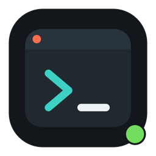
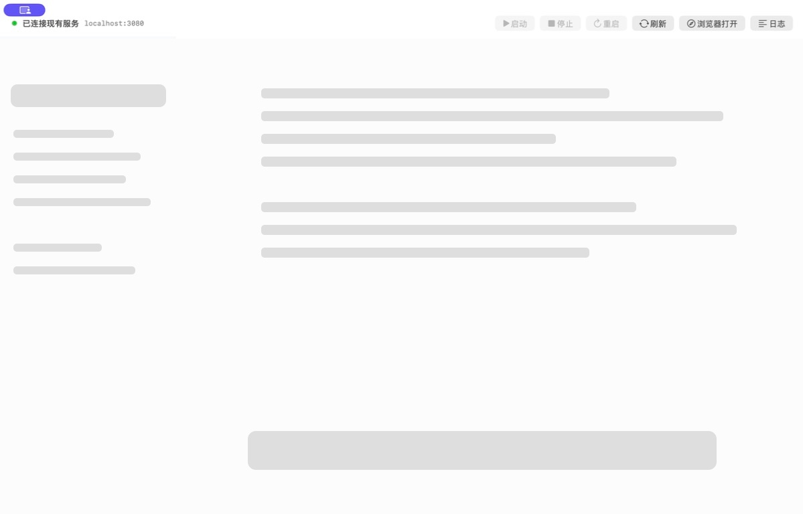
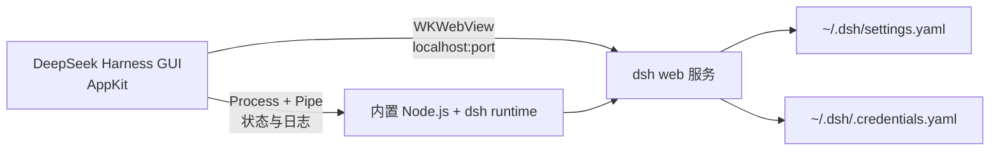

# DeepSeek Harness GUI

<p align="center">
  
</p>

<p align="center">
  <strong>一个面向 macOS 的 DeepSeek Harness 原生 GUI 外壳</strong><br>
  用 AppKit 管理本地 dsh 服务，用 WKWebView 提供桌面窗口体验。
</p>

<p align="center">
  <a href="https://github.com/liangqianxing/deepseek-harness-gui/actions/workflows/ci.yml"></a>
  <a href="https://github.com/liangqianxing/deepseek-harness-gui/releases"></a>
  <a href="https://www.apple.com/macos/"></a>
  <a href="LICENSE"></a>
</p>

> 本项目是社区维护的**非官方 GUI**，不隶属于 DeepSeek。DeepSeek Harness 的名称、商标和上游代码归各自权利人所有。

<details>
<summary>目录</summary>

- [项目定位](#项目定位)
- [版本与兼容性](#版本与兼容性)
- [界面预览](#界面预览)
- [功能](#功能)
- [快速开始](#快速开始)
- [Release](#release)
- [使用方式](#使用方式)
- [配置 dsh](#配置-dsh)
- [服务生命周期](#服务生命周期)
- [架构](#架构)
- [故障排查](#故障排查)
- [安全与隐私](#安全与隐私)
- [开发与验证](#开发与验证)
- [项目结构](#项目结构)
- [许可证](#许可证)

</details>

## 项目定位

[DeepSeek Harness](https://github.com/deepseek-ai/deepseek-harness) 本身提供 Web 界面和本地 Coding Agent 能力。本项目把它包装成一个原生 macOS 应用，补充以下桌面端能力：

- 自动发现并复用已经运行的 dsh，避免重复占用端口；
- 没有可复用实例时，启动应用内置的 Node.js 和 dsh runtime；
- 监控本地服务状态，展示启动输出和错误日志；
- 退出时只清理由 GUI 自己启动的进程；
- 继续使用 dsh 原有的配置和凭证文件，不创建第二套配置格式。

GUI 外壳只连接本机的 `localhost` / `127.0.0.1`，不做代理、不转发远程请求。dsh 本身仍会按照用户配置访问模型服务和其他外部 API。

## 版本与兼容性

| 项目 | 版本/范围 |
| --- | --- |
| GUI | `0.1.0` |
| 内置 dsh | `0.1.0-rc.7` |
| 内置 Node.js | `22.23.1` |
| macOS | `13.0+` |
| 架构 | `arm64`、`x86_64` |
| CI | GitHub Actions `macos-14` |

## 界面预览

下面是经过脱敏的界面预览。真实工作区名称、会话内容、文件路径和模型请求不会放入公开仓库：



## 功能

- **服务状态**：显示检查中、启动中、已连接现有服务、GUI 已启动、已停止或失败；
- **服务操作**：启动、停止、重启、刷新页面、在系统浏览器打开；
- **运行日志**：查看最近的 dsh 输出，日志同时写入本地日志文件；
- **会话保持**：使用 WebKit 默认数据存储，应用重启后保留 dsh WebView 会话；
- **外链隔离**：WebView 内只允许当前本地 dsh 地址，普通 HTTP/HTTPS 链接交给系统浏览器；
- **进程归属**：只停止 GUI 自己启动的 dsh，不终止终端或其他应用管理的实例；
- **内置 runtime**：Finder 启动不依赖终端 `PATH`，优先使用 bundle 内的 Node.js 与 dsh。

快捷键：

| 快捷键 | 操作 |
| --- | --- |
| `⌘R` | 刷新 dsh 页面 |
| `⌘⇧R` | 重启 GUI 自己启动的 dsh |
| `⌘⇧O` | 在系统浏览器中打开当前 dsh 地址 |
| `⌘L` | 显示或隐藏运行日志 |
| `⌘Q` | 退出应用，并清理 GUI 自己启动的 dsh |

## 快速开始

### 环境要求

- macOS 13 或更高版本；
- Apple Silicon 或 Intel Mac；
- [Xcode Command Line Tools](https://developer.apple.com/library/archive/technotes/tn2339/_index.html)；
- 首次构建时可以访问 `nodejs.org` 和 npm registry；
- 至少约 1 GB 可用磁盘空间，用于下载缓存和约 426 MB 的 app bundle。

安装命令行工具（尚未安装时）：

```bash
xcode-select --install
```

### 从源码构建

当前 Release 是源码发布，仓库不提供预签名或公证的 `.app` 下载包。请在本机完成构建：

```bash
git clone https://github.com/liangqianxing/deepseek-harness-gui.git
cd deepseek-harness-gui
./build.sh
open "$HOME/Applications/DeepSeek Harness GUI.app"
```

`build.sh` 会完成以下步骤：

1. 编译 Swift/AppKit + WebKit 应用；
2. 下载并校验固定版本的官方 Node.js；
3. 根据 `Runtime/package-lock.json` 安装固定版本的 dsh runtime；
4. 将 Node.js、dsh 和依赖放进 app bundle；
5. 生成本地 ad-hoc 签名并验证 bundle；
6. 将应用原子化安装到 `~/Applications/DeepSeek Harness GUI.app`。

完整 bundle 约 426 MB，具体大小会随架构和依赖变化。构建缓存位于 `.runtime-cache/`，不会提交到 Git。

只生成 `dist/` 产物、不安装到用户目录：

```bash
INSTALL_LOCAL=0 ./build.sh
```

可选的构建缓存变量：

```bash
RUNTIME_CACHE="$HOME/Library/Caches/deepseek-harness-gui" ./build.sh
NPM_CACHE="$HOME/Library/Caches/npm" ./build.sh
```

### Release

- [最新 Release](https://github.com/liangqianxing/deepseek-harness-gui/releases)
- [v0.1.0](https://github.com/liangqianxing/deepseek-harness-gui/releases/tag/v0.1.0)
- [CI 构建记录](https://github.com/liangqianxing/deepseek-harness-gui/actions)

应用使用本地 ad-hoc 签名，适合开发和个人使用。面向其他用户分发时，应使用自己的 Apple Developer 证书完成签名和公证；否则 macOS 可能显示 Gatekeeper 警告。

## 使用方式

### 启动与服务复用

默认端口是 `3080`。应用启动后会请求 `http://localhost:3080/` 并检查返回内容是否为 dsh 页面：

1. **已有 dsh**：直接复用，停止和重启按钮保持不可用，不会终止外部进程；
2. **没有 dsh**：使用 app bundle 内的 runtime 启动 dsh；
3. **3080 被其他程序占用**：以 `--port 0` 启动 dsh，由 dsh 分配空闲端口，然后自动加载新端口；
4. **服务退出或连续不可达**：GUI 显示失败状态，并保留日志供排查。

GUI 启动器优先使用内置 runtime；在开发环境中，如果内置 runtime 不存在，则依次尝试系统 `dsh` 和固定版本的 `npx` 包。

推荐在浏览器中使用 `http://localhost:<端口>`，而不是 `127.0.0.1`。部分浏览器对两者的安全上下文和本地文件系统 API 行为不同。

### 修改端口

通过环境变量指定默认端口。直接运行 app 二进制时：

```bash
DSH_GUI_PORT=3098 \
  "$HOME/Applications/DeepSeek Harness GUI.app/Contents/MacOS/DeepSeekHarnessGUI"
```

Finder 启动应用不会读取当前终端的临时环境变量；需要固定端口时，可以在 Shell 中直接运行上面的命令，或在自己的启动器中设置环境变量。

### 日志位置

窗口中的“日志”按钮显示最近日志；完整日志写入：

```text
~/Library/Logs/DeepSeek Harness GUI.log
```

GUI 会把 dsh 子进程的标准输出和错误输出写入窗口及日志文件。因此 GUI 不主动读取或持久化 provider 凭证，但 dsh 或插件输出的敏感内容仍可能落盘；请勿将 key、token 或其他秘密打印到 dsh 日志中。

## 配置 dsh

GUI 外壳不另行保存凭证。模型、provider 和凭证仍由 dsh 的页面与配置文件管理。请先阅读 [DeepSeek Harness 文档](https://github.com/deepseek-ai/deepseek-harness)，再按所使用的适配器填写配置。

典型配置形态如下，所有占位值都必须替换：

```yaml
# 默认位置：~/.dsh/settings.yaml
llm-deepseek:
  # 这是凭证引用名，不是 API key 本身。
  apiKeyEnv: PROVIDER_API_KEY
  baseURL: https://example.invalid/v1
  models:
    - id: example-model
      name: Example Model
      contextWindow: 128000

agent-default-model:
  provider: deepseek-official
  model: example-model
```

凭证由 dsh 自己读取，例如保存在 `~/.dsh/.credentials.yaml`。如果通过 `DSH_HOME` 使用自定义目录，请注意 Finder 启动通常不会继承终端环境变量；从终端启动 GUI 时可以显式传入：

```bash
DSH_HOME="$HOME/.dsh-work" \
  "$HOME/Applications/DeepSeek Harness GUI.app/Contents/MacOS/DeepSeekHarnessGUI"
```

注意事项：

- 不要把真实 API key、token 或 `.credentials.yaml` 提交到仓库；
- `apiKeyEnv` 填的是 dsh 凭证引用名，不是密钥内容；
- GUI 不创建第二套凭证存储，也不把密钥写入 `NSUserDefaults`；
- 修改配置后按 `⌘R` 刷新 WebView，必要时重启 dsh 使适配器重新加载。

## 服务生命周期

| 状态 | 含义 | 可用操作 |
| --- | --- | --- |
| 检查服务 | 正在探测本地 dsh | 等待 |
| 正在启动 | GUI 正在拉起自己的 dsh | 停止 |
| GUI 已启动 | 当前 dsh 由 GUI 管理 | 停止、重启、刷新、浏览器打开 |
| 已连接现有服务 | 当前 dsh 由其他进程管理 | 刷新、浏览器打开 |
| 已停止 | 当前没有可用 dsh | 启动 |
| 启动失败 | 启动或健康检查失败 | 启动、查看日志 |

这种“只管理自己启动的进程”的边界是有意设计的，避免 GUI 因为端口号误杀用户在终端中运行的 dsh。

## 架构



核心代码集中在 `Sources/main.swift`：

- `DSHServiceController`：服务探测、启动、端口解析、进程归属、停止和重启；
- `MainWindowController`：原生工具栏、WebView、日志面板和导航白名单；
- `Resources/start-dsh.sh`：优先选择 app bundle 内 runtime 的启动器；
- `build.sh`：下载校验 Node、安装锁定依赖、编译、签名和原子化发布 app。

## 故障排查

### `EADDRINUSE: address already in use`

这是手动运行 `dsh web --port 3080` 时最常见的情况，表示 3080 已经有监听者。GUI 启动时会先识别并复用现有 dsh；如果占用者不是 dsh，则会让新 dsh 自动选择端口。以 GUI 顶部显示的实际端口为准。

查看端口状态：

```bash
lsof -nP -iTCP:3080 -sTCP:LISTEN
curl -i http://localhost:3080/
```

手动启动时也可以选择其他端口：

```bash
npx --yes @deepseek-ai/dsh@0.1.0-rc.7 web --host 127.0.0.1 --port 3098
```

### “启动”按钮不可用

如果顶部显示“已连接现有服务”，说明 dsh 是由终端或其他应用启动的。GUI 只提供复用、刷新和浏览器打开，不会强制接管或停止外部进程；退出 GUI 也不会终止该实例。

### 页面加载失败

1. 查看窗口底部日志或 `~/Library/Logs/DeepSeek Harness GUI.log`；
2. 用 `curl -i http://localhost:<端口>/` 确认本地页面是否返回 `200`；
3. 确认 dsh 的配置文件格式和凭证引用名正确；
4. 按 `⌘R` 重试，必要时只重启由 GUI 自己启动的 dsh。

### Finder 启动后找不到 Node 或 dsh

正式构建会把 Node 和 dsh 放进 app bundle，不依赖 Finder 的 `PATH`。如果是开发中的未打包二进制，请确认 `dsh`、`npx` 或 Node 位于常见系统路径，或直接运行 `./build.sh` 重新生成完整 bundle。

### `xcrun`、`swift` 或 `iconutil` 不存在

确认 Command Line Tools 已安装并指向有效开发者目录：

```bash
xcode-select -p
swift --version
```

必要时重新执行 `xcode-select --install`，然后重试 `./scripts/check.sh`。

### 构建阶段下载失败

构建会访问 nodejs.org 和 npm registry，并校验 Node.js 压缩包 SHA-256。网络恢复后重新执行 `./build.sh` 即可；若缓存文件损坏，脚本会自动重新下载。还可以指定新的 `RUNTIME_CACHE` 目录后重试。

## 安全与隐私

- GUI/WebView 层只访问本机 `localhost` / `127.0.0.1`；dsh 仍会访问用户配置的模型 API；
- provider 凭证继续由 dsh 管理，GUI 不把它们写入 `NSUserDefaults` 或仓库；
- dsh 子进程输出会进入 GUI 日志，请勿输出或分享包含 key/token 的日志；
- WebView 内的外部链接交给系统浏览器打开；
- WebKit 使用持久化 website data，应用重启后可能保留会话和站点数据；
- 本地 ad-hoc 签名不等同于 Apple 公证，分发前请使用自己的开发者身份签名；
- 安全问题请按 [SECURITY.md](SECURITY.md) 的方式提交，不要在公开 Issue 中粘贴凭证或敏感日志。

## 开发与验证

运行脚本语法、Info.plist、图标生成和 Swift release 编译检查：

```bash
./scripts/check.sh
```

执行完整打包流程但不安装到 `~/Applications`：

```bash
INSTALL_LOCAL=0 ./build.sh
```

只编译 Swift Package：

```bash
swift build --configuration release
```

修改代码生成的图标后：

```bash
swift scripts/generate-icon.swift /tmp/AppIcon.iconset
iconutil -c icns /tmp/AppIcon.iconset -o Resources/AppIcon.icns
```

提交 Pull Request 前请阅读 [CONTRIBUTING.md](CONTRIBUTING.md)，并说明涉及服务归属、端口选择或进程退出行为的验证命令。

## 项目结构

```text
Sources/main.swift             AppKit 窗口、WKWebView 和服务状态机
Resources/start-dsh.sh         dsh 启动器
Resources/Info.plist           macOS bundle 元数据
Resources/AppIcon.icns         应用图标
Runtime/package.json           runtime 版本声明
Runtime/package-lock.json      可复现依赖锁定
build.sh                       编译、打包、签名和安装
scripts/check.sh               本地/CI 编译检查
scripts/generate-icon.swift    生成图标源文件
docs/app-icon.png              README 图标预览
docs/gui-preview.jpg           脱敏界面预览
.github/workflows/ci.yml      GitHub Actions 编译检查
.github/dependabot.yml        npm 和 Actions 依赖更新
CONTRIBUTING.md                贡献指南
SECURITY.md                    安全策略
LICENSE                        MIT 许可证
```

## 许可证

本项目代码采用 [MIT License](LICENSE)。DeepSeek Harness、Node.js、WebKit 及其他依赖分别遵循其上游许可证；构建 bundle 内包含 Node.js 许可证副本 `NODE-LICENSE`。
